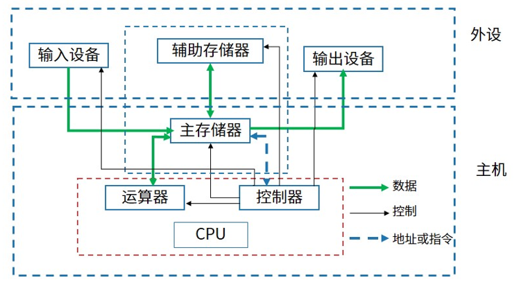
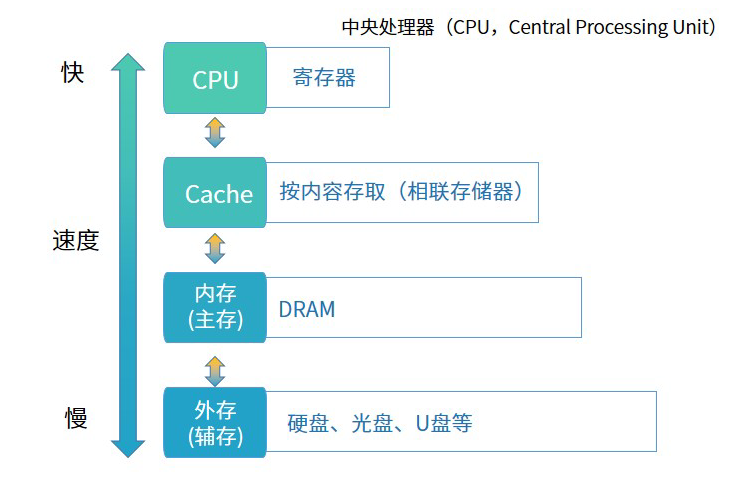

# 计算机组成与体系结构


## 计算机组成结构

计算机系统是一个硬件和软件的综合体，原始的冯•诺依曼（Von Neumann）计算机在结构上是以**运算器**为中心的，而发展到现在，已转向以**存储器**为中心了，下图是计算机最基本的组成图：




### CPU 组成

CPU 的内核分为**运算器**和**控制器**


- **运算器**

1. 算术逻辑单元 ALU：数据的算术运算和逻辑运算
2. 累加寄存器 AC：通用寄存器，为ALU提供一个工作区，用于暂存数据
3. 数据缓冲寄存器 DR：写内存时，暂存指令或数据
4. 状态寄存器 PSW：存状态标志与控制标志（争议：也有将其归为控制器）

- **控制器**

1. 程序计数器 PC：存储下一条要执行指令的地址
2. 指令寄存器 IR：存储即将执行的指令
3. 指令译码器 ID：对指令中的操作码字段进行分析解析
4. 时序部件：提供时序控制信号


计算机执行程序时，在一个指令周期的过程中，为了能够从内存中读指令操作码，首先是将( A )的内容送到地址总线上。  

**A 程序计数器 PC**  
B 指令寄存器 IR  
C 状态寄存器 SR  
D 通用寄存器 GR


### 冯诺依曼结构


冯诺依曼结构也称普林斯顿结构，是一种将**程序指令存储器**和**数据存储器**合并在一起的存储器结构。

冯诺依曼结构的特点：

1. 一般用于 PC 处理器，如i3，i5，i7处理器；
2. 指令与数据存储器合并在一起；
3. 指令与数据都通过相同的数据总线传输。


### 哈佛结构


哈佛结构是一种将**程序指令存储**和**数据存储**分开的存储器结构。哈佛结构是一种并行体系结构，它的主要特点是将**程序**和**数据存储**在不同的存储空间内，即**程序存储器**和**数据存储器**是两个独立的存储器，每个存储器独立编址、独立访问。

哈佛结构的特点：

1. **一般用于嵌入式系统处理器（DSP）数字信号处理（DSP，Digital Signal Processing）**
2. 指令与数据分开存储，可以并行读取，有较高的数据吞吐率
3. 有四条总线：指令和数据的数据总线与地址总线


### 芯片

1. DSP

DSP 芯片，也称数字信号处理器，是一种特别适合与进行数字信号处理运算的微处理器，其主要应用是实时快速地实现各种数字信号处理算法。


2. SoC

System on Chip，简称 Soc，也即片上系统。从狭义角度讲，它是信息系统核心的芯片集成，是将系统关键部件集成在一块芯片上；从广义角度讲，SoC 是一个微小型系统，如果说中央处理器（CPU）是大脑，那么 SoC 是大脑，那么 SoC 就是包括大脑、心脏、眼睛和手的系统。


3. MPU

微机中的中央处理器（CPU）称为微处理器（MPU），是构成微机的核心部件，也可以说是微机的心脏。它起到控制整个微型计算机工作的作用，产生控制信号对相应的部件进行控制，并执行相应的操作。


4. MCU

微控制单元（Microcontroller Unit：MCU），又称单片微型计算机（Single Chip Microcomputer）或者单片机，是把中央处理器（Central Process Unit：CPU）的频率与规格做适当缩减，并将内存（memory）、计数器（Timer）、USB、A/D转换、UART、PLC、DMA等周边接口，甚至LCD驱动电路都整合在单一芯片上，形成芯片级的计算机，为不同的应用场合做不同组合控制。


目前处理器市场中存在 CPU 和 DSP 两种类型处理器，分别用于不同场景，这两种处理器具有不同的体系结构，DSP 采用( B )。

A 冯·诺伊曼结构  
**B 哈佛结构**  
C FPGA 结构  
D 与 GPU 相同结构


嵌入式处理器是嵌入式系统的核心部件，一般可分为嵌入式微处理器(MPU)、微控制器(MCU)、数字信号处理器(DSP)和片上系统(SoC)。以下叙述中，错误的是（ A ）。

**A MPU 在安全性和可靠性等方面进行增强，适用于运算量较大的智能系统**  
B MCU 典型代表是单片机,体积小从而使功耗和成本下降  
C DSP 处理器对系统结构和指令进行了特殊设计,适合数字信号处理  
D SoC 是一个有专用目标的集成电路，其中包括完整系统并有嵌入式软件的全部内容


## 存储系统





计算机存储结构上图所示，总结如下：（速度由高到低排序，容量由低到高排序，成本由高到低排序）

1. CPU 寄存器：速度最快，容量最小，成本高
2. Cache：按内容存取
3. 内存（主存）：随机存储器（RAM）只读存储器（ROM）
4. 外存（辅存）：硬盘、光盘、U盘等


计算机采用分级存储体系的主要目的是为了（ D ）。

A 解决主存容量不足的问题  
B 提高存储器读写可靠性  
C 提高外设访问效率  
**D 解决存储的容量、价格和速度之间的矛盾**


### Cache

1. Cache 的功能：提高 CPU 数据输入输出的速率，突破冯诺依曼瓶颈（CPU 与存储系统间数据传输宽带限制）；
2. 在计算器的存储体系中，Cache 是访问速度最快的层次（不存在 CPU 寄存器的情况下）；
3. Cache 对程序员来说是透明的；
4. 使用 Cache 改善系统性能的依据是程序的局部性原理（时间和空间局部性）。
5. **时间局部性**：指程序中的某条执行一旦执行，不久以后该指令可能再次执行，典型原因是由于程序中存在着大量的循环操作。
6. **空间局部性**：指一旦程序访问了某个存储单元，不久以后，其附近的存储单元也将被访问，即程序在一段时间内所访问的地址可能集中在一定的范围内，其典型情况是程序顺序执行。
7. **工作集理论**：工作集是进程运行时被频繁访问的页面集合。


在嵌入式系统设计时，下面几种存储结构中对程序员是透明的是( A ）。

**A 高速缓存**
B 磁盘存储器
C 内存
D flash 存储器


如何计算系统获取缓存的平均周期  t3 ，如果使用 h 代表 Cache 的访问命中率，t1 表示 Cache 的周期时间，t3 表示主存周期时间，以读操作为例，算法如下：

```
t3 = h * t1 + (1 - h) * t2
```
其中，(1 - h)又称为失效率（未命中率）。


## 存储管理


## 数据传输控制方式


## 总线


## CISC 与 RISC


## 流水线


## 校验码


