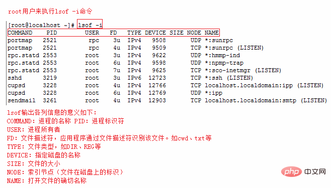

# 常用 Linux 命令


## 切换用户

`su` 是最简单的用户切换命令，通过该命令可以实现任何身份的切换，包括从普通用户切换为 root 用户、从 root 用户切换为普通用户以及普通用户之间的切换。

> 普通用户之间切换以及普通用户切换至 root 用户，都需要知晓对方的密码，只有正确输入密码，才能实现切换；从 root 用户切换至其他用户，无需知晓对方密码，直接可切换成功。

su 命令的基本格式如下：

```shell
[root@localhost ~]# su [选项] 用户名
```

选项：

- `-`：当前用户不仅切换为指定用户的身份，同时所用的工作环境也切换为此用户的环境（包括 `PATH` 变量、`MAIL` 变量等），使用 - 选项可省略用户名，默认会切换为 root 用户。
- `-l`：同 `-` 的使用类似，也就是在切换用户身份的同时，完整切换工作环境，但后面需要添加欲切换的使用者账号。
- `-p`：表示切换为指定用户的身份，但不改变当前的工作环境（不使用切换用户的配置文件）。
- `-m`：和 `-p` 一样；
- `-c`命令：仅切换用户执行一次命令，执行后自动切换回来，该选项后通常会带有要执行的命令。

```shell
# 选项：
-m, -p, --preserve-environment  不重置环境变量
-g, --group <组>             指定主组
-G, --supp-group <组>        指定一个辅助组

-, -l, --login                  使 shell 成为登录 shell
-c, --command <命令>            使用 -c 向 shell 传递一条命令
--session-command <命令>        使用 -c 向 shell 传递一条命令而不创建新会话
-f, --fast                      向shell 传递 -f 选项(csh 或 tcsh)
-s, --shell <shell>             若 /etc/shells 允许，则运行 shell

-h, --help     显示此帮助并退出
-V, --version  输出版本信息并退出
```

示例1：

```shell
[lamp@localhost ~]$ su - root
密码： 输入 root 用户的密码
#"-"代表连带环境变量一起切换，不能省略
```

示例2：

```shell
[lamp@localhost ~]$ whoami
lamp
#当前我是lamp
[lamp@localhost ~]$ su - -c "useradd user1" root
密码：
#不切换成root，但是执行useradd命令添加user1用户
[lamp@localhost ~]$ whoami
lamp
#我还是lamp
[lamp@localhost ~]$ grep "user1' /etc/passwd
userl:x:502:504::/home/user1:/bin/bash
#user用户已经添加了
```

除了像例 2 这样，执行一条命令后用户身份会随即自动切换回来，其他切换用户的方式不会自动切换，只能使用 `exit` 命令进行手动切换，例如：

```shell
[lamp@localhost ~]$ whoami
lamp
#当前我是lamp
[lamp@localhost ~]$ su - lamp1
Password:   <--输入lamp1用户的密码
#切换至 lamp1 用户的工作环境
[lamp@localhost ~]$ whoami
lamp1
#什么也不做，立即退出切换环境
[lamp1@localhost ~]$ exit
logout
[lamp@localhost ~]$ whoami
lamp
```

**su 和 su - 的区别**

注意，使用 `su` 命令时，有 `-` 和没有 `-` 是完全不同的，`-` 选项表示在切换用户身份的同时，连当前使用的环境变量也切换成指定用户的。我们知道，环境变量是用来定义操作系统环境的，因此如果系统环境没有随用户身份切换，很多命令无法正确执行。

举个例子，普通用户 `lamp` 通过 `su` 命令切换成 `root` 用户，但没有使用 `-` 选项，这样情况下，虽然看似是 `root` 用户，但系统中的 `$PATH` 环境变量依然是 `lamp` 的（而不是 `root` 的），因此当前工作环境中，并不包含 `/sbin`、`/usr/sbin`等超级用户命令的保存路径，这就导致很多管理员命令根本无法使用。不仅如此，当 `root` 用户接受邮件时，会发现收到的是 `lamp` 用户的邮件，因为环境变量 `$MAIL` 也没有切换。
初学者可以这样理解它们之间的区别，即有 `-` 选项，切换用户身份更彻底；反之，只切换了一部分，这会导致某些命令运行出现问题或错误（例如无法使用 `service` 命令）。

通过下面这个例子，可直观的看到 `su` 和 `su -` 的区别：

```shell
[lamp@localhost ~]$ whoami
lamp
#查询用户身份，我是lamp
[lamp@localhost ~]$ su root
密码:
<- 输入root密码
#切换到root，但是没有切换环境变量。注意：普通用户切换到root需要密码
[root@localhost ~]# env | grep lamp
#查看环境变量，提取包含lamp的行
USER=lamp
#用户名还是lamp，而不是root
PATH=/usr/lib/qt-3.3/bin:/usr/local/bin:/bin:/usr/bin:/usr/local/sbin:/usr/sbin:/sbin:/home/lamp/bin
#命令査找的路径不包含超级用户路径
MAIL=/var/spool/mail/lamp
PWD=/home/lamp
LOGNAME=lamp
#邮箱、主目录、目前用户名还是lamp
```

可以看到，在不使用 `su -` 的情况下，虽然用户身份成功切换，但环境变量依旧用的是原用户的，切换并不完整。


## 查看防火墙及开放端口


### 查看 Linux 系统版本的命令


#### 1. 查看Linux内核版本命令（两种方法）

- `cat /proc/version`
- `uname -a`


#### 2. 查看Linux系统版本的命令（3种方法）

- `lsb_release -a` 即可列出所有版本信息，这个命令适用于所有的 Linux 发行版，包括 RedHat、SUSE、Debian…等发行版。
- `cat /etc/redhat-release` 这种方法只适合 Redhat 系的 Linux。
- `cat /etc/issue` 此命令也适用于所有的 Linux 发行版。


### iptables防火墙（CentOS 6）

#### 1、service 方式

1）查看防火墙状态：

```shell
[root@centos6 ~]# service iptables status
```

2）开启防火墙：

```shell
[root@centos6 ~]# service iptables start
```

3）关闭防火墙：

```shell
[root@centos6 ~]# service iptables stop
```

4）重启防火墙：

```shell
[root@centos6 ~]# service iptables restart
```

5）永久关闭防火墙：

```shell
[root@centos6 ~]# chkconfig iptables off
```

6）永久关闭后重启：

```shell
[root@centos6 ~]# chkconfig iptables on
```

#### 2、iptables 方式

1）先进入 `init.d` 目录，命令如下：

```shell
[root@centos6 ~]# cd /etc/init.d/
```

2）查看防火墙状态：

```shell
[root@centos6 init.d]# /etc/init.d/iptables status
```

3）暂时关闭防火墙：

```shell
[root@centos6 init.d]# /etc/init.d/iptables stop
```

4）重启防火墙：

```shell
[root@centos6 init.d]# /etc/init.d/iptables restart
```


### firewalld 防火墙（CentOS 7）

#### 1、查看 firewalld 服务状态

```shell
systemctl status firewalld
```

出现 `Active: active (running)` 高亮显示则表示是启动状态。

出现 `Active: inactive (dead)` 灰色表示停止，看单词也行。

#### 2、查看 firewalld 的状态

```shell
firewall-cmd --state
```

#### 3、开启、重启、关闭firewalld.service服务

1）开启

```shell
service firewalld start
```

2）重启

```shell
service firewalld restart
```

3）关闭

```shell
service firewalld stop
```

#### 4、查看防火墙规则

```shell
firewall-cmd --list-all
```

#### 5、查询、开放、关闭端口

1）查询端口是否开放

```shell
firewall-cmd --query-port=8080/tcp
```

2）开放80端口

```shell
firewall-cmd --permanent --add-port=80/tcp
```

3）移除端口

```shell
firewall-cmd --permanent --remove-port=8080/tcp
```

4）重启防火墙(修改配置后要重启防火墙)

```shell
firewall-cmd --reload
```

#### 6、参数解释

1）firwall-cmd：是 Linux 提供的操作 firewall 的一个工具；
2）--permanent：表示设置为持久；
3）--add-port：标识添加的端口；


## 查看端口占用


Linux 查看端口占用情况的方法：

1、使用 `lsof` 命令，语法格式 `lsof -i:端口号`；  
2、使用 `netstat` 命令，该命令可以显示 tcp、udp 的端口和进程等相关情况，语法格式 `netstat -tunlp | grep 端口号`。

### lsof

`lsof(list open files)` 是一个列出当前系统打开文件的工具。

lsof 查看端口占用语法格式：

```shell
lsof -i:端口号
```

实例

查看服务器 8000 端口的占用情况：

```shell
# lsof -i:8000

COMMAND   PID USER   FD   TYPE   DEVICE SIZE/OFF NODE NAME
nodejs  26993 root   10u  IPv4 37999514      0t0  TCP *:8000 (LISTEN)
```

可以看到 8000 端口已经被轻 nodejs 服务占用。

`lsof -i` 需要 root 用户的权限来执行，如下图：




更多 lsof 的命令如下：

```shell
lsof -i:8080    查看8080端口占用

lsof abc.txt    显示开启文件abc.txt的进程

lsof -c abc     显示abc进程现在打开的文件

lsof -c -p 1234     列出进程号为1234的进程所打开的文件

lsof -g gid     显示归属 gid 的进程情况

lsof +d /usr/local/     显示目录下被进程开启的文件

lsof +D /usr/local/     同上, 但是会搜索目录下的目录, 时间较长

lsof -d 4     显示使用 fd 为4的进程

lsof -i -U     显示所有打开的端口和 UNIX domain 文件
```


### netstat

`netstat -tunlp` 用于显示 tcp，udp 的端口和进程等相关情况。

netstat 查看端口占用语法格式：

```shell
netstat -tunlp | grep 端口号
```

- `-t` (tcp) 仅显示tcp相关选项
- `-u` (udp)仅显示udp相关选项
- `-n` 拒绝显示别名，能显示数字的全部转化为数字
- `-l` 仅列出在Listen(监听)的服务状态
- `-p` 显示建立相关链接的程序名

例如查看 8000 端口的情况，使用以下命令：

```shell
# netstat -tunlp | grep 8000

tcp        0      0 0.0.0.0:8000            0.0.0.0:*               LISTEN      26993/nodejs
```

**更多命令：**

```shell
netstat -ntlp   // 查看当前所有tcp端口

netstat -ntulp | grep 80   // 查看所有80端口使用情况

netstat -ntulp | grep 3306   // 查看所有3306端口使用情况
```

### fuser

使用 `fuser` 命令可以直接在 Linux 上查看端口被哪个进程占用了。

```shell
fuser 80/tcp
```

上面的命令查看 80 端口被哪个进程占用了。你可能会看到类似下面的结果：

如果想看到详情可以加上 `-v` 开关，运行结果里会包含进程的名字：

```shell
fuser -v 80/tcp
```

如果要杀掉进程可以使用 -k 开关：

```shell
fuser -k 80/tcp
```


## 查看内存占用

```shell
# -m 以MB为单位的方式显示
free -m
```

## 查看剩余空间

```shell
df -Th
```
参数说明：

```shell
-a或--all：包含全部的文件系统；
--block-size=<区块大小>：以指定的区块大小来显示区块数目；
-h或--human-readable：以可读性较高的方式来显示信息；
-H或--si：与-h参数相同，但在计算时是以1000 Bytes为换算单位而非1024 Bytes；
-i或--inodes：显示inode的信息；
-k或--kilobytes：指定区块大小为1024字节；
-l或--local：仅显示本地端的文件系统；
-m或--megabytes：指定区块大小为1048576字节；
--no-sync：在取得磁盘使用信息前，不要执行sync指令，此为预设值；
-P或--portability：使用POSIX的输出格式；
--sync：在取得磁盘使用信息前，先执行sync指令；
-t<文件系统类型>或--type=<文件系统类型>：仅显示指定文件系统类型的磁盘信息；
-T或--print-type：显示文件系统的类型；
-x<文件系统类型>或--exclude-type=<文件系统类型>：不要显示指定文件系统类型的磁盘信息；
--help：显示帮助；
--version：显示版本信息。
```


## 查看文件和目录大小的命令

```shell
du -sh 文件/目录名
```
参数说明：

```shell
-a或-all 显示目录中个别文件的大小。
-b或-bytes 显示目录或文件大小时，以byte为单位。
-c或--total 除了显示个别目录或文件的大小外，同时也显示所有目录或文件的总和。
-k或--kilobytes 以KB(1024bytes)为单位输出。
-m或--megabytes 以MB为单位输出。
-s或--summarize 仅显示总计，只列出最后加总的值。
-h或--human-readable 以K，M，G为单位，提高信息的可读性。
-x或--one-file-xystem 以一开始处理时的文件系统为准，若遇上其它不同的文件系统目录则略过。
-L<符号链接>或--dereference<符号链接> 显示选项中所指定符号链接的源文件大小。
-S或--separate-dirs 显示个别目录的大小时，并不含其子目录的大小。
-X<文件>或--exclude-from=<文件> 在<文件>指定目录或文件。
--exclude=<目录或文件> 略过指定的目录或文件。
-D或--dereference-args 显示指定符号链接的源文件大小。
-H或--si 与-h参数相同，但是K，M，G是以1000为换算单位。
-l或--count-links 重复计算硬件链接的文件。
```


## 排序命令


sort命令可以用于将文件内容排序并输出，也可以用于将某些查询命令的执行结果排序后输出，比如要将文件夹中的文件按大小排序，可以用以下命令：

```shell
du -a|sort -rn
```
管道前面的`du –a`就是列出目录下所有的文件和目录的大小，后面的sort命令就是排序。

其中-r参数代表反向排序，因为sort默认是从小到大排序的，加-r是从大到小排序

-n代表按照数字排序，只认数字不认单位，本例中的数字就是文件大小，单位是默认的KB，所以这个命令不能用du -ah，这会使排序结果出现2M小于100K的情况。

```shell
-b：忽略每行前面开始出的空格字符；
-c：检查文件是否已经按照顺序排序；
-d：排序时，处理英文字母、数字及空格字符外，忽略其他的字符；
-f：排序时，将小写字母视为大写字母；
-i：排序时，除了040至176之间的ASCII字符外，忽略其他的字符；
-m：将几个排序号的文件进行合并；
-M：将前面3个字母依照月份的缩写进行排序；
-n：依照数值的大小排序；
-o<输出文件>：将排序后的结果存入制定的文件；
-r：以相反的顺序来排序；
-t<分隔字符>：指定排序时所用的栏位分隔字符；
+<起始栏位>-<结束栏位>：以指定的栏位来排序，范围由起始栏位到结束栏位的前一栏位。
```

由参数可见sort命令主要还是用于文件内容输出的

## 只显示前几行的命令

head命令可以用于显示文件的前几行，也可以用于显示某些查询命令结果的前几行
比如要将文件夹中的文件按大小排序，而且只看最大的几个，可以用以下命令：

head后面的-5表示显示前5行，不加数字则默认显示前10行

```shell
du -a|sort -rn|head -5
```

参数说明：

```shell
-n<数字>：指定显示头部内容的行数；
-c<字符数>：指定显示头部内容的字符数；
-v：总是显示文件名的头信息；
-q：不显示文件名的头信息。
```

